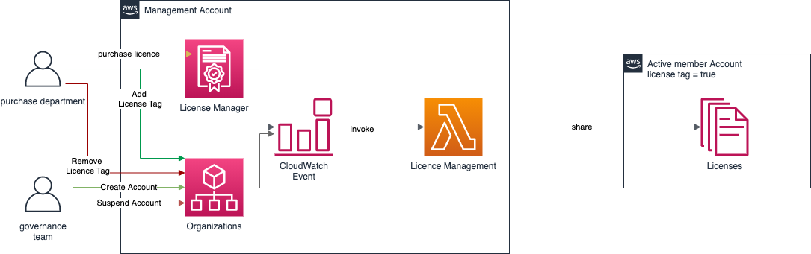

Share Marketplace subscriptions with your AWS Organization


## UseCase
In order to by able to manage Marketplace Subscriptions for a whole aws Organization in one Account - to help the purchase department with their daily work and prevent contracts from being concluded without them, we developed a solution that will enable multi account managing of marketplace subscriptions trough a whole aws organization.

The Solution will take care that if new Accounts are added, existing are SUSPENDED or even if the specific tag for licences is updated at one Account - that every licences which are existing will be shared or removed from that Account.



:warning: The API is currently very slow - when i was  adding removing around 20 Accounts it was already taking 20-40 mins.

### Update Trigger

- TagResource: Will trigger an update of one account only. Python will grab the specific changed parameter for Licence Management from the requestParameters of the presented CloudTrail event.

- ListReceivedGrants: After subscribing to a new Product in AWS Marketplace a ListReceivedGrants from AWSMarketPlaceSession will be invoked - this event will trigger the automation to update all accounts to share / revoke access to the new product.

## SCP
The following Policy will take care that only the Purchase department is able to subcribe to new Marketplace products or unsubscribe old products.

```{
      "Version": "2012-10-17",
      "Statement": [
            {
                  "Sid": "DenyMarketplace",
                  "Effect": "Deny",
                  "Action": [
                        "aws-marketplace:AcceptAgreementApprovalRequest",
                        "aws-marketplace:RejectAgreementApprovalRequest",
                        "aws-marketplace:Subscribe",
                        "aws-marketplace:Unsubscribe"
                  ],
                  "Resource": [
                        "*"
                  ],
                  "Condition": {
                        "StringNotLike": {
                              "aws:PrincipalArn": "arn:aws:iam::*:role/{ResourcePrefix}-PurchaseTeamRole"
                        }
                  }
            }
      ]
}```

## How to deploy solution
For deployment of this automation i created a taskfile - you can follow this (documentation)[https://taskfile.dev/#/usage] how to us it.
