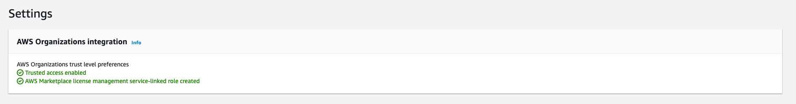

AWS Marketplace Automation

Share Marketplace subscriptions with your AWS Organization


⚠️ The API is currently very slow - when we were removing around 2 Licenses in around 20 Accounts it was already taking 1-2 hours.

ℹ️ - You cannot share a License which is already existing in the target account. 
### Update Trigger

- TagResource: Will trigger an update of one account only. Python will grab the specific changed parameter for Licence Management from the requestParameters of the presented CloudTrail event.

- ListReceivedGrants: After subscribing to a new Product in AWS Marketplace a ListReceivedGrants from AWSMarketPlaceSession will be invoked - this event will trigger the automation to update all accounts to share / revoke access to the new product.

## SCP
The following Policy will take care that only the Purchase department is able to subcribe to new Marketplace products or unsubscribe old products.

```json
{
      "Version": "2012-10-17",
      "Statement": [
            {
                  "Sid": "DenyMarketplace",
                  "Effect": "Deny",
                  "Action": [
                        "aws-marketplace:AcceptAgreementApprovalRequest",
                        "aws-marketplace:RejectAgreementApprovalRequest",
                        "aws-marketplace:Subscribe",
                        "aws-marketplace:Unsubscribe"
                  ],
                  "Resource": [
                        "*"
                  ],
                  "Condition": {
                        "StringNotLike": {
                              "aws:PrincipalArn": "arn:aws:iam::*:role/{ResourcePrefix}-PurchaseTeamRole"
                        }
                  }
            }
      ]
}
```
## Prerequisite:

License grants can be activated only when both the license administrator and the grant recipient have enabled the AWS Marketplace Service Linked Role, or trusted access is enabled for AWS Marketplace in the management account of your organization. 

To enable trusted access between Organizations and License Manager:

1. Sign in to the [AWS Management Console](https://console.aws.amazon.com/) using your organization's management account.

2. Navigate to the [License Manager console](https://console.aws.amazon.com/license-manager) and choose Settings.

3. Choose Edit.

4. Choose Link AWS Organizations accounts.


## How to deploy solution

For deployment of this automation i created a taskfile - you can follow this [documentation](https://taskfile.dev/#/usage) how to us it.

```
task deploy
```